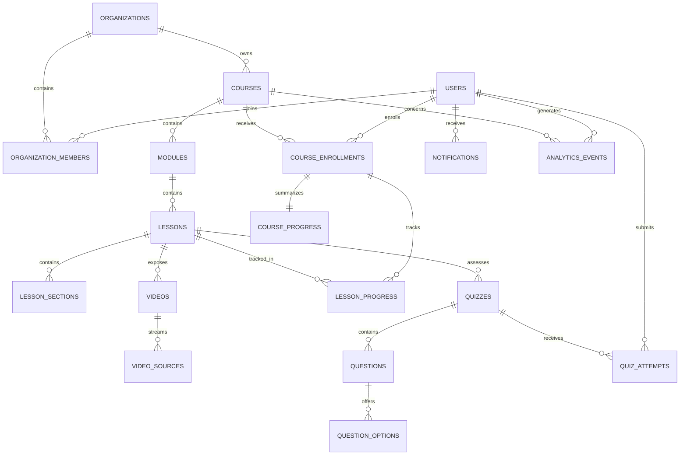

# Entity relationship overview

```mermaid
erDiagram
  USERS ||--o{ ORGANIZATION_MEMBERS : joins
  ORGANIZATIONS ||--o{ ORGANIZATION_MEMBERS : contains
  ORGANIZATIONS ||--o{ COURSES : owns
  COURSES ||--o{ MODULES : contains
  MODULES ||--o{ LESSONS : contains
  LESSONS ||--o{ LESSON_SECTIONS : contains
  LESSONS ||--o{ VIDEOS : exposes
  VIDEOS ||--o{ VIDEO_SOURCES : streams
  USERS ||--o{ COURSE_ENROLLMENTS : enrolls
  COURSES ||--o{ COURSE_ENROLLMENTS : receives
  COURSE_ENROLLMENTS ||--|| COURSE_PROGRESS : summarizes
  COURSE_ENROLLMENTS ||--o{ LESSON_PROGRESS : tracks
  LESSONS ||--o{ LESSON_PROGRESS : tracked_in
  LESSONS ||--o{ QUIZZES : assesses
  QUIZZES ||--o{ QUESTIONS : contains
  QUESTIONS ||--o{ QUESTION_OPTIONS : offers
  USERS ||--o{ QUIZ_ATTEMPTS : submits
  QUIZZES ||--o{ QUIZ_ATTEMPTS : receives
  USERS ||--o{ NOTIFICATIONS : receives
  USERS ||--o{ ANALYTICS_EVENTS : generates
  COURSES ||--o{ ANALYTICS_EVENTS : concerns
```
