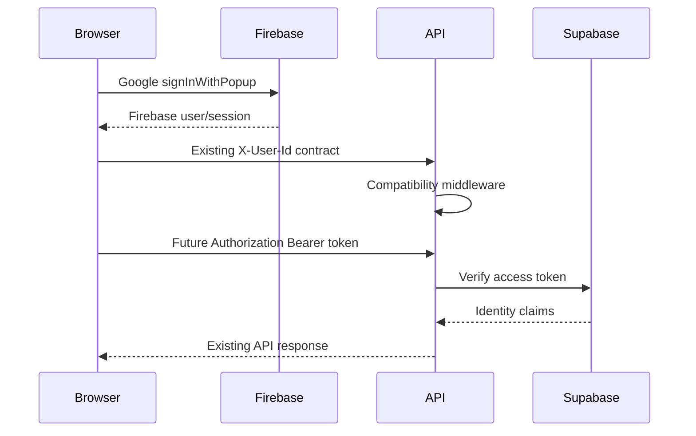

# Authentication flow

## Session lifecycle

1. Provider establishes the user session.
2. `AuthProvider` observes the provider session.
3. `SessionProvider` exposes session state to the application.
4. Backend middleware resolves bearer identity or the development compatibility header.
5. Authorization middleware evaluates roles and permissions.
6. Logout clears the provider session and local session metadata.

Refresh-token rotation, device revocation, password recovery, 2FA, SSO, and persistent session tables are reserved for the next identity migration.

## Role hierarchy

`super_admin` > `admin` > `organization_admin` > `enterprise_manager` > `instructor` / `teaching_assistant` > `student` > `guest`.

Roles are extensible strings; permissions are independent capability keys such as `course.read`, `analytics.view`, `admin.access`, and `user.manage`.

## API protection

Existing public course/module/note/file reads remain public. Existing authenticated APIs retain their current middleware behavior. New endpoints should compose `requireAuth`, then `requireRole` or `requirePermission`, request validation, and audit logging.
